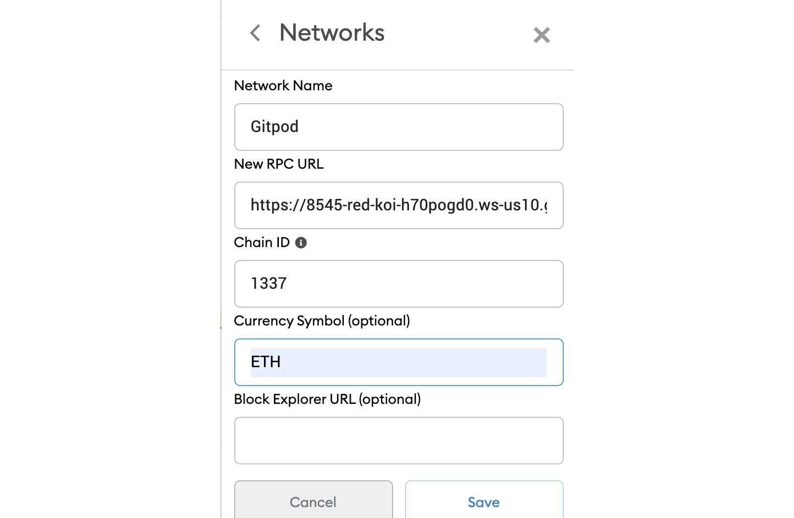
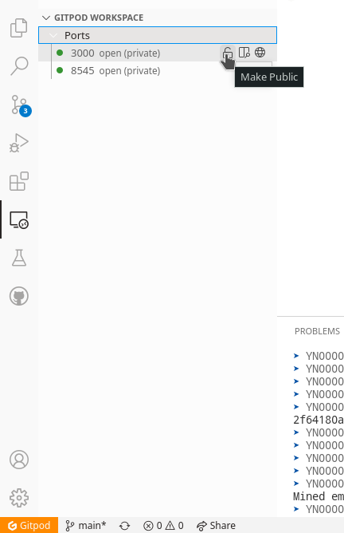

[](https://docs.mythx.io/dashboard/github-badges)
# DeveloperDAO $CODE contract & claim site

A monorepo containing both the $CODE token contract & the claim web app.

## Contents

<!--ts-->

- [Related](#related)
- [Development](#prerequisites)
  - [Prerequisites](#prerequisites)
  - [Libraries used](#libraries-used)
  - [Run in Gitpod](#run-in-gitpod)
  - [Run Locally](#run-locally)
  - [Running Tests](#running-tests)
  - [Scripts](#scripts)
- [Acknowledgements](#acknowledgements)
- [License](#license)
<!--te-->

## Related

- [member-and-early-contributor-rewards](https://github.com/Developer-DAO/member-and-early-contributor-rewards): Snapshots for the NFT Holders (Memebr allocation) & POAP/Snapshot votes (Early contributors).
- [developer-dao-erc20-contract](https://github.com/Developer-DAO/developer-dao-erc20-contract): Nader's initial ERC20 implementation, derived from the ENS token. We used the latest state here in /packages/hardhat.
- [merkletreejs](https://github.com/miguelmota/merkletreejs): Utility to generate the Merkletree.

## Main Scripts

Here is a list of the main scripts to run:

- Default dev environment, esp. when working on the web app: `yarn dev`
- Spin-up the storybook for isolated UI development: `yarn storybook`
- This will create the Merkle Tree: `yarn execute localhost scripts/getMerkleRoot data/nft_holders.json data/votes_and_poap_holders.json`
- This script sets the merkle root hash on the contract: `yarn execute localhost scripts/setMerkleRoot`

### Deploying

To deploy to Rinkeby, these are the steps:

1. Set env vars ETH_NODE_URI = 'https://rinkeby.infura.io/v3/$projectId' (or other node services e.g. alchemy, quicknode), MNEMONIC = 'words words words.... words'
2. `yarn deploy rinkeby`
3. `yarn execute rinkeby scripts/setMerkleRoot <merkleRoot>`
4. `cd packages/hardhat && npx hardhat --network rinkeby etherscan-verify --api-key <etherscan API key>`
5. `yarn execute rinkeby scripts/merkleRootSanityCheck`

The code that gets network specific resources from env variables (like ETH_NODE_URI and MNEMONIC) is located at `packages/hardhat/utils/network.ts`.
To change how e.g. the accounts are defined (by setting PKs directly instead of using mnemonic), the `accounts` function in that file would need to be changed. This function is then used in hardhat.config.ts to get the accounts info per network.

## Development

This section covers all info necessary to start development on the contract and website.

### Prerequisites

- [Yarn](https://yarnpkg.com/)
- [Node.js](https://nodejs.org/en/download/)
- [MetaMask wallet browser extension](https://metamask.io/download.html).

### Libraries used

Here's an overview of the included frameworks and tools.

- **Next.js** - Minimalistic framework for server-rendered React applications.
- **Typescript** - Superset of JavaScript which primarily provides optional static typing, classes and interfaces.
- **ESLint** - The pluggable linting utility.
- **Yarn Workspace** - Easier monorepo management.
- **Github Actions** - Tools to automate all your software workflows.
- **Chakra UI** - UI & Styling Library.
- **Typechain** - TypeScript bindings for Ethereum smart contracts.
- **Hardhat** - Ethereum development environment for professionals.
- **Hardhat-deploy** - A Hardhat Plugin For Replicable Deployments And Easy Testing.
- **Jest** - A delightful JavaScript Testing Framework with a focus on simplicity.
- **Mocha** - A feature-rich JavaScript test framework.
- **Cypress** - A JavaScript End to End Testing Framework.
- **React Testing Library** - Simple and complete React DOM testing utilities that encourage good testing practices.

### Run in Gitpod

To run this project in Gitpod, follow these steps:
<br/>

1. Click this link to deploy to gitpod
   <br/>

[](https://gitpod.io/#github.com/Developer-DAO/code-claim-site)

2. Import the RPC address given to you by GitPod into your MetaMask wallet

This endpoint will look something like this:

```bash
https://8545-copper-swordtail-j1mvhxv3.ws-eu18.gitpod.io/
```

The chain ID should be 1337. If you have a localhost rpc set up, you may need to overwrite it.
<br/>



you can also change your status of your open ports by going to port settings.
<br/>



### Run Locally

Clone the project, then Install dependencies

```bash
  yarn install
```

Start hardhat & Next.js server

```bash
  yarn dev
```

### Running Tests

To run tests, run the following command

```bash
  yarn test
```

### Scripts

Here is the list of npm scripts you can execute:

Some of them relies on [packages/hardhat/\_scripts.js](./packages/hardhat/_scripts.js) to allow parameterizing it via command line argument
<br/><br/>

`yarn prepare`

As a standard lifecycle npm script, it is executed automatically upon install. It generates typechain to get you started with type safe contract interactions.
<br/><br/>

`yarn dev`

this will start a next.js and Hardhat development server .
<br/><br/>

`yarn test`

These will execute your tests in `packages/next-app` and `packages/hardhat`.
<br/><br/>

`yarn build`

this will build `packages/next-app` and compile `packages/hardhat` for production.
<br/><br/>

`yarn deploy <network> [args...]`

This will deploy the contract on the specified network.

Behind the scene it uses `hardhat deploy` command so you can append any argument for it
<br/><br/>

`yarn start`

this will start a production Next.js server located in `packages/next-app`.
<br/><br/>

`yarn lint`, `yarn lint:fix`, `yarn format` and `yarn format:fix`

These will lint and format your code under `packages` folder. the `:fix` version will modify the files to match the requirement specified in `.eslintrc` and `.prettierrc.`.

<br/><br/>

`yarn compile`

These will compile your contracts
<br/><br/>

`yarn void:deploy`

This will deploy your contracts on the in-memory hardhat network and exit, leaving no trace. quick way to ensure deployments work as intended without consequences
<br/><br/>

`yarn hardhat:test [mocha args...]`

These will execute your tests in `packages/hardhat` directory using mocha. you can also pass extra arguments to mocha
<br/><br/>

`yarn hardhat:coverage`

These will produce a coverage report for `packages/hardhat` tests.
<br/><br/>

`yarn gas`

These will produce a gas report for functions used in the `packages/hardhat` tests
<br/><br/>

`yarn hardhat:dev`

These will run a local hardhat network on `localhost:8545` and deploy your contracts on it. Plus it will watch for any changes and redeploy them.
<br/><br/>

`yarn local:dev`

This assumes a local node it running on `localhost:8545`. It will deploy your contracts on it. Plus it will watch for any changes and redeploy them.
<br/><br/>

`yarn execute <network> <file.ts> [args...]`

This will execute the script `<file.ts>` against the specified network
<br/><br/>

`yarn export <network> <file.json>`

This will export the abi+address of deployed contract to `<file.json>`
<br/><br/>

`yarn fork:execute <network> [--blockNumber <blockNumber>] [--deploy] <file.ts> [args...]`

This will execute the script `<file.ts>` against a temporary fork of the specified network

if `--deploy` is used, deploy scripts will be executed
<br/><br/>

`yarn fork:deploy <network> [--blockNumber <blockNumber>] [args...]`

This will deploy the contract against a temporary fork of the specified network.

Behind the scene it uses `hardhat deploy` command so you can append any argument for it
<br/><br/>

`yarn fork:test <network> [--blockNumber <blockNumber>] [mocha args...]`

This will test the contract against a temporary fork of the specified network.
<br/><br/>

`yarn fork:dev <network> [--blockNumber <blockNumber>] [args...]`

This will deploy the contract against a fork of the specified network and it will keep running as a node.

Behind the scene it uses `hardhat node` command so you can append any argument for it

## Acknowledgements

This project was started from the [nextjs-dapp-starter-ts](https://github.com/G3root/nextjs-dapp-starter-ts) starter project.

## License

[MIT](https://choosealicense.com/licenses/mit/)
